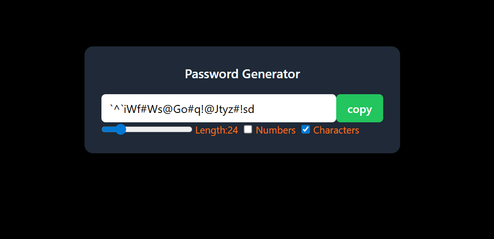

# 🔐 Password Generator

A simple and interactive **Password Generator** built using **React** and **Tailwind CSS** that allows users to generate secure passwords with customizable options.

---

## 📸 Project UI



---

## 📖 What I Learned

Through this project, I strengthened my understanding of **React Hooks** such as **`useState`**, **`useEffect`**, **`useCallback`**, and **`useRef`**.  
I learned how to effectively manage **component state**, handle **user inputs** like **checkboxes** and **range sliders**, and generate **dynamic data** based on changing **dependencies**.

I also gained hands-on experience in identifying and fixing **common React bugs**, especially those related to **state updates**, **event handling**, and **logic errors**.  
Overall, this project significantly improved my confidence in building **interactive UI components** using **React** and **Tailwind CSS**.

---

## ✨ Key Features

- 🔑 **Dynamic password generation**
- 📏 **Custom length selection**
- 🔢 Toggle options for **numbers**
- 🔣 Toggle options for **special characters**
- 📋 **Copy to clipboard** functionality
- 🎨 **Clean and responsive UI**

---


```bash
npm install
npm run dev


